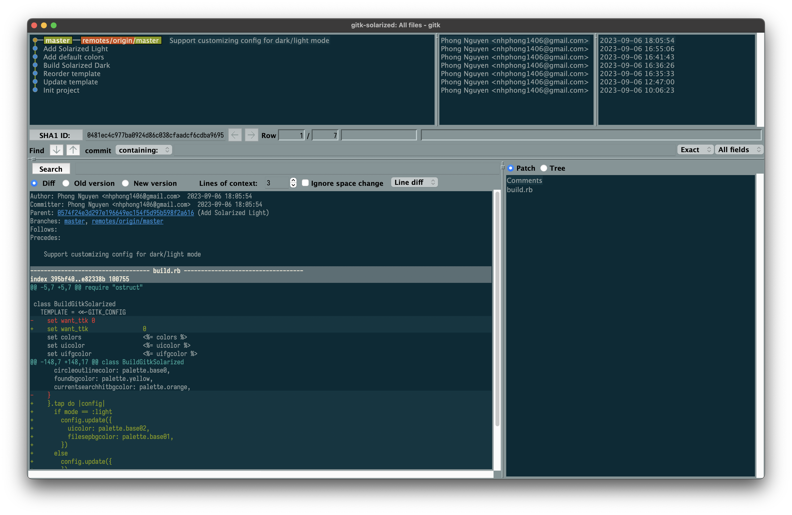
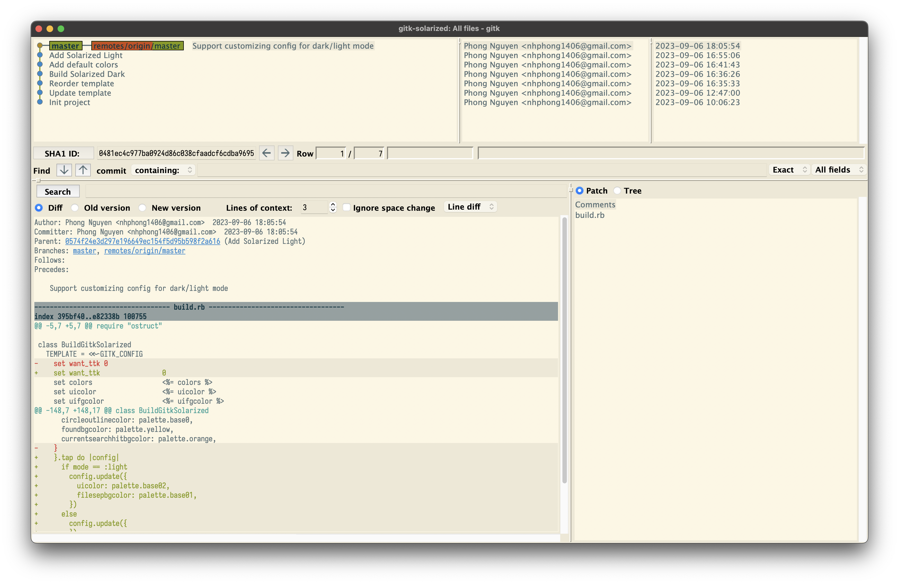

# Solarized for gitk

A dark and light theme for [gitk](https://git-scm.com/docs/gitk).





## Install


```shell
mkdir -p ~/.config/git
git clone https://github.com/phongnh/gitk-solarized.git ~/src/gitk-solarized
cd ~/src/gitk-solarized
# Use Solarized Dark
ruby build.rb dark >> ~/.config/git/gitk
# Use Solarized Light
ruby build.rb light >> ~/.config/git/gitk
```

## Credits

Solarized palette is copied from [https://ethanschoonover.com/solarized](https://ethanschoonover.com/solarized).
